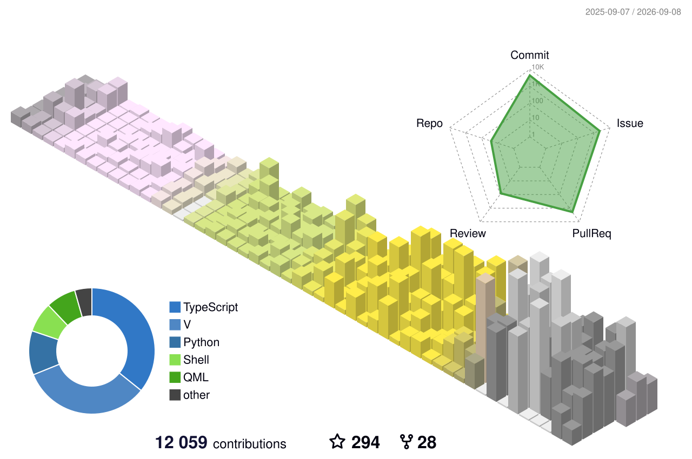

### Hi there 👋

I'm **Ulises Jeremias** — Solutions Architect at [NaNLABS](https://github.com/nanlabs), Core Team Member at [V](https://github.com/vlang), and AUR Maintainer. I build developer tooling, AI-powered workflows, CLI apps, and infrastructure automation — mostly in TypeScript, Go, Shell, and Python.

- 🔭 **Currently working on:** [HorneroConfig dotfiles](https://github.com/ulises-jeremias/dotfiles), [agentic-workstation](https://github.com/ulises-jeremias/agentic-workstation), [agentic-harness](https://github.com/ulises-jeremias/agentic-harness), [V Scientific Library (VSL)](https://github.com/vlang/vsl), and [V Tensor Library (VTL)](https://github.com/vlang/vtl)
- 🌱 **Learning:** Science Computation, Linux distro development, AI-assisted workflows
- 💬 **Ask me about** anything — I enjoy helping others!
- 🌍 **Open to collaborating** on Linux tooling, CLI apps, AI agents, and science computing
- 📫 **Reach me:** [ulisescf.24@gmail.com](mailto:ulisescf.24@gmail.com)
- 💬 **Discord:** [Join the community](https://discord.gg/bR5VyATgka)
- 😄 **Pronouns:** He/Him
- ⚡ **Fun fact:** I'm also a hornero 🐦 — I always build my own nest from scratch

## Featured Projects

### ⚙️ AI Workspace & Developer Tools

| Repo | Description |
|------|-------------|
| [dotfiles](https://github.com/ulises-jeremias/dotfiles) | HorneroConfig — comprehensive dotfiles framework for any WM/OS |
| [agentic-workstation](https://github.com/ulises-jeremias/agentic-workstation) | Personal AI developer workstation layer — agents, skills & CLI helpers for AI coding assistants |
| [agentic-harness](https://github.com/ulises-jeremias/agentic-harness) | Portable AI workspace orchestrator — persistent memory, personas, skills for Claude Code, opencode, Cursor, Gemini CLI |
| [agent-toolkit](https://github.com/ulises-jeremias/agent-toolkit) | Composable AI agent toolkit — skills, agents, loops, and MCP templates for Claude Code, Cursor, OpenCode, Copilot, Windsurf, and Pi |

### 🦄 V Language

| Repo | Description |
|------|-------------|
| [V Scientific Library (VSL)](https://github.com/vlang/vsl) | Scientific computing library for V — numerical methods, linear algebra, statistics |
| [V Tensor Library (VTL)](https://github.com/vlang/vtl) | Tensor and ML library for V |
| [setup-v](https://github.com/vlang/setup-v) | https://github.com/vlang/setup-v |
| [rxv](https://github.com/ulises-jeremias/rxv) | Reactive Extensions for the V language |

### 🚀 Open Source & Community

| Repo | Description |
|------|-------------|
| [Create Node App](https://github.com/Create-Node-App) | CLI to scaffold Node.js apps — React, NestJS, Monorepos, WebExtensions, Docker |
| [recoil-devtools](https://github.com/ulises-jeremias/recoil-devtools) | DevTools for Recoil with hot reloading, action replay & customizable UI (archived) |
| [nanlabs/awesome-nan](https://github.com/nanlabs/awesome-nan) | 🏆 Led by me — curated list of all NaNLABS open-source reference repos, boilerplates, and tools |

> **@ NaNLABS:** I lead the initiative for open-source reference repositories and boilerplates. Everything is catalogued in [awesome-nan](https://github.com/nanlabs/awesome-nan) — including [terraform-aws-modules](https://github.com/nanlabs/terraform-aws-modules), [devops-reference](https://github.com/nanlabs/devops-reference), and [20+ more](https://github.com/nanlabs) public repos.

## Published Packages

Package metadata and download data come from the registries; `img.shields.io` serves the badge images. Download counts are monthly registry downloads, not unique users or installations.

### npm

| Project | Package | Version | Monthly downloads |
|---------|---------|---------|-------------------|
| [Create Node App](https://github.com/Create-Node-App/create-node-app) | [`create-awesome-node-app`](https://www.npmjs.com/package/create-awesome-node-app) |  |  |
| [agent-toolkit](https://github.com/ulises-jeremias/agent-toolkit) | [`agent-toolkit-cli`](https://www.npmjs.com/package/agent-toolkit-cli) |  |  |
| [recoil-devtools](https://github.com/ulises-jeremias/recoil-devtools) | [`recoil-devtools`](https://www.npmjs.com/package/recoil-devtools) |  |  |
| ↳ Recoil package | [`recoil-devtools-dock`](https://www.npmjs.com/package/recoil-devtools-dock) |  |  |
| ↳ Recoil package | [`recoil-devtools-log-monitor`](https://www.npmjs.com/package/recoil-devtools-log-monitor) |  |  |
| ↳ Recoil package | [`recoil-devtools-logger`](https://www.npmjs.com/package/recoil-devtools-logger) |  |  |
| ↳ Recoil package | [`recoil-devtools-themes`](https://www.npmjs.com/package/recoil-devtools-themes) |  |  |

### PyPI

| Project | Package | Version | Monthly downloads |
|---------|---------|---------|-------------------|
| [Create Python App](https://github.com/Create-Python-App/create-python-app) | [`create-awesome-python-app`](https://pypi.org/project/create-awesome-python-app/) |  |  |
| [agent-toolkit](https://github.com/ulises-jeremias/agent-toolkit) | [`agent-toolkit-cli`](https://pypi.org/project/agent-toolkit-cli/) |  |  |

### AUR

| Project | Package | Version |
|---------|---------|---------|
| [Create Node App](https://github.com/Create-Node-App/create-node-app) | [`create-awesome-node-app`](https://aur.archlinux.org/packages/create-awesome-node-app) |  |
| [Create Python App](https://github.com/Create-Python-App/create-python-app) | [`create-awesome-python-app`](https://aur.archlinux.org/packages/create-awesome-python-app) |  |
| [Create Vlang App](https://github.com/Create-Vlang-App/create-vlang-app) | [`create-vlang-app`](https://aur.archlinux.org/packages/create-vlang-app) |  |
| [agent-toolkit](https://github.com/ulises-jeremias/agent-toolkit) | [`agent-toolkit`](https://aur.archlinux.org/packages/agent-toolkit) · [`agent-toolkit-bin`](https://aur.archlinux.org/packages/agent-toolkit-bin) |   |

### Homebrew

| Project | Formula | Tap |
|---------|---------|-----|
| [Create Node App](https://github.com/Create-Node-App/create-node-app) | [`create-awesome-node-app`](https://github.com/Create-Node-App/homebrew-tap) | [`Create-Node-App/homebrew-tap`](https://github.com/Create-Node-App/homebrew-tap) |
| [Create Python App](https://github.com/Create-Python-App/create-python-app) | [`create-awesome-python-app`](https://github.com/Create-Python-App/homebrew-tap) | [`Create-Python-App/homebrew-tap`](https://github.com/Create-Python-App/homebrew-tap) |
| [Create Vlang App](https://github.com/Create-Vlang-App/create-vlang-app) | [`create-vlang-app`](https://github.com/Create-Vlang-App/homebrew-tap) | [`Create-Vlang-App/homebrew-tap`](https://github.com/Create-Vlang-App/homebrew-tap) |
| [agent-toolkit](https://github.com/ulises-jeremias/agent-toolkit) | [`agent-toolkit`](https://formulae.brew.sh/formula/agent-toolkit) | [`ulises-jeremias/homebrew-tap`](https://github.com/ulises-jeremias/homebrew-tap) |

For platforms without a stable public monthly-download metric, the table links the package or tap directly instead of presenting an estimated number.

## Community

Questions, ideas, template requests, and collaboration are welcome in the Create Awesome community.

## 📈 GitHub Stats

<picture>
  <source media="(prefers-color-scheme: dark)" alt="" align="left" width="55%" srcset="./profile-3d-contrib/profile-south-season.svg"/>
  
</picture>

## GitRoll Profile

---

  
  
  
  

