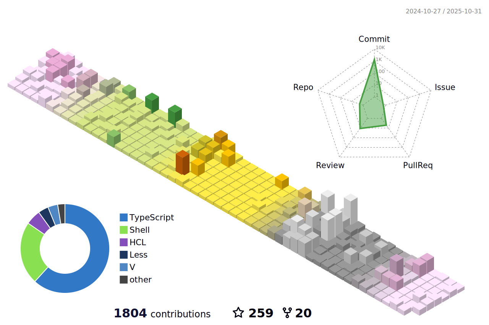

### Hi there 👋

- 🔭 I’m currently working on [V Scientific Library](https://github.com/vlang/vsl), [V Tensor Library](https://github.com/vlang/vtl), [Dotfiles generator](https://github.com/ulises-jeremias/dotfiles) and [Create Awesome Node App](https://github.com/Create-Node-App/create-node-app)!
- 🌱 I’m currently learning more about Science Computation and Linux distros development
- 👯 I’m looking to collaborate on anything Linux, Science Computing or Machine Learning related!
- 🤔 I’m looking for help with [Create Awesome Node App](https://github.com/Create-Node-App/create-node-app), [Recoil DevTools](https://github.com/ulises-jeremias/recoil-devtools) and [Dotfiles generator](https://github.com/ulises-jeremias/dotfiles).
- 💬 Ask me about anything!
- 📫 How to reach me: ulisescf.24@gmail.com
- 😄 Pronouns: He/Him
- ⚡ Fun fact: I'll think about it

## 📈 GitHub Stats

<picture>
  <source media="(prefers-color-scheme: dark)" alt="" align="left" width="55%" srcset="./profile-3d-contrib/profile-south-season.svg"/>
  
</picture>

<!--  -->

